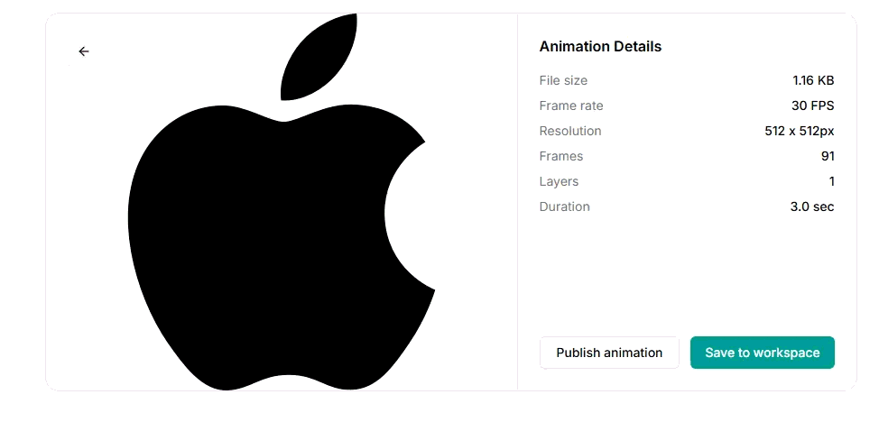
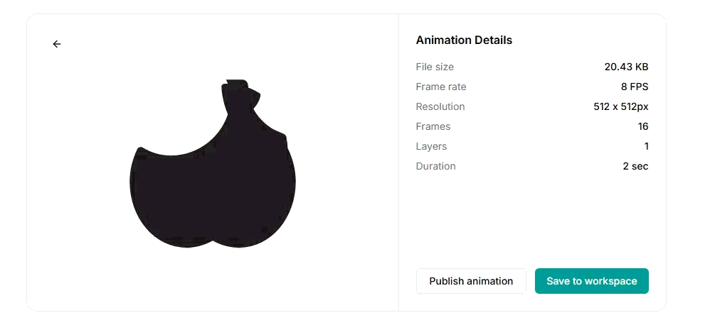

# AnimTOON: Token-Efficient Vector Animation Generation

> **5-7x fewer tokens than OmniLottie (CVPR 2026) for generating Lottie animations, running on a single consumer GPU.**

AnimTOON is a compact, plain-text animation format designed for LLMs to generate Lottie animations with minimal tokens. Unlike existing approaches that require custom tokenizers and large GPU clusters, AnimTOON works with any LLM and runs on consumer hardware.

## Demo: AnimTOON vs OmniLottie (Same Prompt)

| AnimTOON (Ours) | OmniLottie (CVPR 2026) |
|:---:|:---:|
|  |  |
| **166 tokens** / 26s / 30fps | **4095 tokens** / 55s+ / 8fps |
| Real SVG shape + AI animation | AI-generated shape (incorrect) |

## Benchmark Results

### Token Efficiency (Measured, Same Prompt)

| Metric | AnimTOON | OmniLottie | Raw Lottie JSON |
|--------|----------|------------|-----------------|
| **Avg Output Tokens** | **166-597** | **616-4095** | **18,202** |
| **Token Reduction** | **98.8% vs JSON** | **~97% vs JSON** | baseline |
| **AnimTOON vs OmniLottie** | **5-7x fewer** | baseline | - |

### Side-by-Side Comparison

| Metric | AnimTOON | OmniLottie |
|--------|----------|------------|
| Output Tokens (simple) | **166** | 616 |
| Output Tokens (complex) | **597** | 4095 |
| Shape + Animation Tokens | **207** (41+166) | 1113 |
| Generation Time | **13-38s** | 55-120s+ |
| Frame Rate | **30 fps** | 8 fps |
| VRAM (inference) | **~5 GB** | ~15.2 GB |
| Model Size | **3B (LoRA)** | 4B (full fine-tune) |
| Training Hardware | **1x RTX 5060 Ti 16GB** | Multi-GPU cluster |
| Custom Tokenizer | **No (plain text)** | Yes (40k custom tokens) |
| Accepts SVG Input | **Yes** | No |
| Generates Shapes | No (uses SVG) | Yes (limited quality) |
| Format | **Plain text (any LLM)** | Custom parameterized tokens |
| File Size | **1-4 KB** | 20-175 KB |
| Format Success Rate | **100%** (converter guarantees) | 88.3% |

## What is AnimTOON?

AnimTOON is a human-readable, token-efficient text format that describes Lottie animations:

```
anim fr=30 dur=120

layer Logo shape
  fill #000000
  path sh x2
  pos [0.5,0.5]
  rot 0.0->-67 0.04->46 0.14->-31 0.28->0 ease=bounce
  scale 0.0->[0,0] 0.14->[90,90] 0.28->[100,100] ease=smooth
  opacity 0.0->0 0.14->100 ease=fade
```

This 166-token output produces a complete animated .lottie file with bounce entrance, rotation wobble, and fade-in.

The same animation in raw Lottie JSON would be **18,000+ tokens**.

## How It Works

```
                    AnimTOON Pipeline
    +--------+     +---------+     +-----------+     +--------+
    |  SVG   | --> | Prompt  | --> | AnimTOON  | --> |.lottie |
    |  File  |     | Builder |     |  Model    |     |  File  |
    +--------+     +---------+     +-----------+     +--------+
                                        |
                                   Generates only
                                   animation text
                                   (166 tokens)
                                        |
                                        v
                                  +-----------+
                                  | Converter |
                                  | (toon_    |
                                  | animator) |
                                  +-----------+
                                        |
                              Combines SVG paths +
                              model animations
                              into .lottie file
```

**Key insight:** The model only generates animation keyframes (166 tokens). Shapes come from the SVG file. The converter deterministically builds valid Lottie JSON. This separation is why we achieve 98.8% token reduction.

## Architecture

### Why AnimTOON is Different

| Approach | What Model Outputs | Tokens | Quality |
|----------|-------------------|--------|---------|
| Raw JSON | Full Lottie JSON with shapes + metadata | 18,000+ | Fragile, many format errors |
| OmniLottie | Custom parameterized tokens (shapes + animation) | 486-4095 | Good but needs custom tokenizer |
| **AnimTOON** | **Plain text animation keyframes only** | **166-597** | **100% valid (converter guarantees)** |

### The AnimTOON Format

```
anim fr=30 dur=120          # framerate, duration

layer Body shape             # layer name + type
  fill #4A90D9               # color
  path ellipse w=0.2 h=0.2  # shape (or 'sh' for complex bezier)
  pos [0.5,0.5]             # position (normalized 0-1)
  rot 0.0->0 1.0->360 ease=linear        # rotation keyframes
  scale 0.0->[0,0] 0.2->[100,100]        # scale keyframes
  opacity 0.0->0 0.3->100 ease=fade      # opacity keyframes
```

**Supported properties:** position, rotation, scale, opacity, fill, stroke, path (ellipse/rect/sh)

**Easing types:** smooth, linear, bounce, fade

## Current Status

> **This is an early research release. The model is approximately 60% through training. Full model release coming after extended training on cloud GPU.**

### What Works Now
- AnimTOON format specification (complete)
- Bidirectional converter: AnimTOON <-> Lottie JSON <-> .lottie (100% reliable)
- SVG -> animated .lottie pipeline (python-lottie + model + converter)
- Simple icon/logo animations: pulse, bounce, spin, fade, wobble, scale
- Correct color matching from text descriptions
- Multi-layer output generation
- 98.8% token reduction vs raw Lottie JSON

### Limitations (Current Model)
- Complex multi-layer choreography needs improvement (most layers static)
- No shape generation (requires SVG input)
- Animation logic sometimes inverted (fade out instead of fade in)
- Layer-to-SVG mapping can misalign for multi-part SVGs
- Trained on MMLottie-2M data only (icon/motion graphics style)
- Not yet trained on character animation (walk cycles, expressions, etc.)

### Roadmap
- **v1.0 (Current):** Icon/logo animation from text + SVG input
- **v1.5:** Better multi-layer coordination, more training data
- **v2.0:** Anime/character animation using Spine/Live2D rigging data
- **v3.0:** Full text-to-SVG+animation pipeline (shape generation + motion)

## Quick Start

### Installation

```bash
# Clone
git clone https://github.com/srk0102/svg-animator.git
cd svg-animator

# Setup (Windows)
setup.bat

# Setup (Mac/Linux)
chmod +x setup.sh && ./setup.sh
```

### Generate Animation from SVG

```bash
python test_svg_pipeline.py inputs/apple.svg
# Output: outputs/apple.lottie
# Preview at: https://lottiefiles.com/preview
```

### Generate Animation from Text

```python
from transformers import AutoModelForCausalLM, AutoTokenizer
import torch

tokenizer = AutoTokenizer.from_pretrained("models/animtoon-3b-v2-merged")
model = AutoModelForCausalLM.from_pretrained(
    "models/animtoon-3b-v2-merged",
    dtype=torch.float16,
    device_map="cuda"
)

prompt = "a red circle pulsing in the center with a smooth bounce"
messages = [{"role": "user", "content": f"Generate AnimTOON animation: {prompt}"}]
text = tokenizer.apply_chat_template(messages, tokenize=False, add_generation_prompt=True)
inputs = tokenizer(text, return_tensors="pt").to("cuda")

with torch.no_grad():
    out = model.generate(**inputs, max_new_tokens=512, temperature=0.7, do_sample=True)
result = tokenizer.decode(out[0][inputs["input_ids"].shape[1]:], skip_special_tokens=True)
print(result)
```

### Convert AnimTOON to .lottie

```python
from src.toon_animator import animtoon_to_dotlottie_full

animtoon_text = """anim fr=30 dur=90
layer Circle shape
  fill #FF4F59
  path ellipse w=0.2 h=0.2
  pos [0.5,0.5]
  scale 0.0->[0,0] 0.15->[120,120] 0.3->[100,100] ease=smooth
  opacity 0.0->0 0.1->100 ease=fade
"""

animtoon_to_dotlottie_full(animtoon_text, "output.lottie")
# Preview at https://lottiefiles.com/preview
```

## Training Your Own Model

### Data Generation

```bash
# Download training data from MMLottie-2M (100k samples)
python src/dataset_pipeline.py --limit 100000 --output data/animtoon_train.jsonl

# Generate layer-aware training data
python src/gen_layer_data.py
```

### Training with Unsloth

```bash
# Setup Unsloth environment
setup_unsloth.bat  # Windows
# or
./setup_unsloth.sh  # Mac/Linux

# Train
python src/train_unsloth.py \
  --data data/animtoon_train.jsonl \
  --model Qwen/Qwen2.5-3B-Instruct \
  --output models/animtoon-3b \
  --epochs 3 \
  --lora-dropout 0
```

### Merge LoRA for Distribution

```bash
python merge_lora.py
# Creates models/animtoon-3b-v2-merged/
```

## Project Structure

```
svg-animator/
  src/
    toon_animator.py      # AnimTOON <-> Lottie converter (core)
    dataset_pipeline.py   # MMLottie-2M data download + conversion
    train_unsloth.py      # LoRA training with Unsloth
    test_inference.py     # Model inference + .lottie generation
    prompt_builder.py     # SVG -> structured prompt
    gen_layer_data.py     # Generate layer-aware training data
    svg_animate.py        # SVG + AnimTOON -> animated Lottie
  test_svg_pipeline.py    # Full SVG animation pipeline
  benchmark_compare.py    # AnimTOON vs OmniLottie benchmark
  merge_lora.py           # Merge LoRA into base model
  inputs/                 # Test SVG files
  outputs/                # Generated .lottie files
  models/                 # Trained model checkpoints
  data/                   # Training data
```

## Technical Details

### Training Configuration

| Parameter | Value |
|-----------|-------|
| Base Model | Qwen/Qwen2.5-3B-Instruct |
| Method | LoRA (r=16, alpha=32) |
| Training Data | 99,650 samples (MMLottie-2M) + 10,000 layer-aware |
| Epochs | ~2 (100k data) + 3 (10k layer data) |
| Hardware | 1x NVIDIA RTX 5060 Ti (16GB VRAM) |
| Framework | Unsloth + Transformers |
| Max Length | 1024 tokens |
| Batch Size | 1 x 16 (gradient accumulation) |
| Final Loss | 0.47 (100k run) / 0.24 (layer-aware run) |

### Token Reduction Analysis

From 99,650 training samples (MMLottie-2M):
- Average original Lottie JSON: **18,202 tokens**
- Average AnimTOON output: **222 tokens**
- Average token reduction: **98.8%**
- Average layers per animation: 6.2

## Comparison with Related Work

| Method | Year | Tokens | Shapes | Animation | Custom Tokenizer | Hardware |
|--------|------|--------|--------|-----------|-----------------|----------|
| Raw Lottie JSON | - | 18,000+ | Yes | Yes | No | Any |
| OmniLottie | CVPR 2026 | 486-4095 | Yes | Yes | Yes (40k tokens) | Multi-GPU |
| LLM4SVG | CVPR 2025 | ~500-2000 | Yes | No | No | Multi-GPU |
| SVGDreamer | CVPR 2024 | N/A | Yes | No | N/A | GPU |
| **AnimTOON** | **2026** | **166-597** | **Via SVG** | **Yes** | **No (plain text)** | **1x Consumer GPU** |

## Vision: Anime Character Animation

The AnimTOON format is designed to scale to complex character animations:

```
# Future: anime character blink animation
anim fr=24 dur=24

layer left_eye shape
  scale 0.0->[100,100] 0.4->[100,10] 0.5->[100,100] ease=smooth

layer right_eye shape
  scale 0.0->[100,100] 0.4->[100,10] 0.5->[100,100] ease=smooth

layer hair shape
  rot 0.0->-2 0.5->2 1.0->-2 ease=smooth
```

Training on Spine/Live2D rigging data will teach the model joint constraints, coordinated multi-layer motion, and character-specific animation patterns.

## License

MIT License

## Citation

```bibtex
@misc{sivaramakrishna2026animtoon,
  title={AnimTOON: Token-Efficient Vector Animation Generation via Compact Text Format},
  author={Siva RamaKrishna},
  year={2026},
  url={https://github.com/srk0102/svg-animator}
}
```

## Acknowledgments

- [OmniLottie](https://github.com/OpenVGLab/OmniLottie) - MMLottie-2M dataset and benchmark inspiration
- [Unsloth](https://github.com/unslothai/unsloth) - Fast LoRA training
- [python-lottie](https://gitlab.com/mattbas/python-lottie) - SVG to Lottie conversion
- [LottieFiles](https://lottiefiles.com/) - Lottie preview and community
